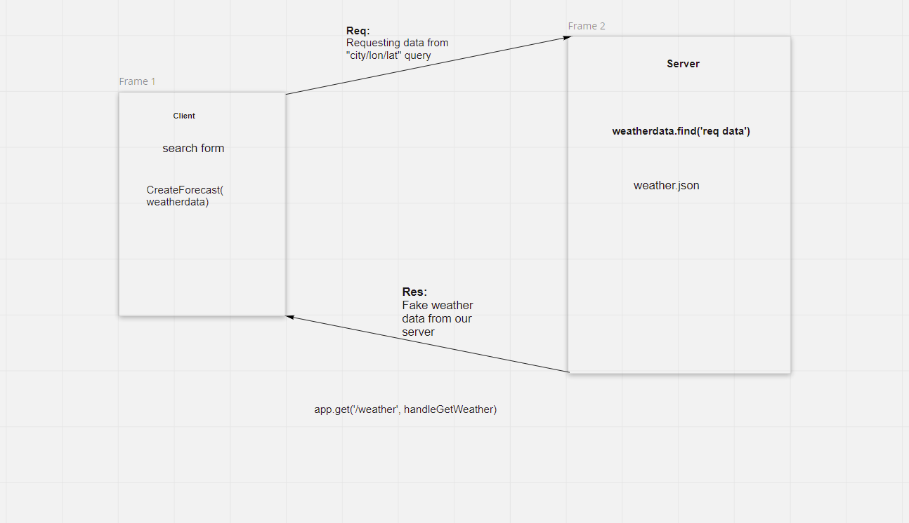

# city-explorer-api

**Author**: Jordan Fleming
**Version**: 1.0.0 (increment the patch/fix version number if you make more commits past your first submission)

## Overview
Building a server to act as an API for our city explorer app.

## Getting Started
<!-- What are the steps that a user must take in order to build this app on their own machine and get it running? -->

## Architecture
This project is made using JavaScript. It requires express, cors, node, and dotenv.
<!-- Provide a detailed description of the application design. What technologies (languages, libraries, etc) you're using, and any other relevant design information. -->

## Change Log
<!-- Use this area to document the iterative changes made to your application as each feature is successfully implemented. Use time stamps. Here's an example:

01-01-2001 4:59pm - Application now has a fully-functional express server, with a GET route for the location resource. -->

## Credit and Collaborations
Worked with Minhang Xie to whiteboard the process.

